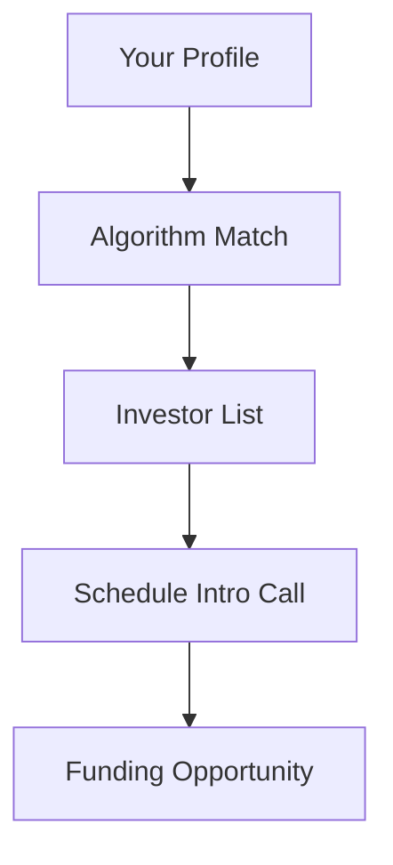

## Overview

COSSA provides a comprehensive platform for open source founders and investors. You access tools designed to build sustainable businesses around open source projects. Key areas include networking, resources, funding opportunities, and events.

<Callout kind="info">
COSSA connects you with peers, strategies, and capital to scale your open source venture.
</Callout>

## Key Features

Explore the core features through these interactive tools.

<Columns cols={2}>
  <Card title="Networking & Collaboration" icon="users" href="#networking">
    Connect with founders and investors. Join discussions and form partnerships.
  </Card>
  <Card title="Resource Library" icon="book-open" href="#resources">
    Access guides, templates, and case studies for open source monetization.
  </Card>
  <Card title="Investor Matching" icon="trending-up" href="#investors">
    Get paired with investors interested in open source startups.
  </Card>
  <Card title="Community Events" icon="calendar" href="#events">
    Participate in webinars, workshops, and virtual meetups.
  </Card>
</Columns>

## Networking and Collaboration

<Expandable title="How to join networking" default-open="true">
Build relationships that drive success. Start by creating your profile.

<Steps>
  <Step title="Sign Up" icon="user-plus">
    Register at `https://cossa.io` with your GitHub account.
  </Step>
  <Step title="Complete Profile" icon="edit-3">
    Add your projects, experience, and goals.
  </Step>
  <Step title="Join Channels" icon="message-circle">
    Select topics like `funding`, `scaling`, or `legal`.
  </Step>
</Steps>
</Expandable>

## Resource Library

Discover proven strategies.

<Tabs>
  <Tab title="Guides" icon="book">
    Download PDFs on dual licensing and SaaS models.
  </Tab>
  <Tab title="Templates" icon="file-text">
    Use contributor agreements and pricing calculators.
  </Tab>
  <Tab title="Case Studies" icon="award">
    Read success stories from members like Sentry and Supabase.
  </Tab>
</Tabs>

<Callout kind="tip">
Search the library by keywords such as `monetization` or `governance` for targeted results.
</Callout>

## Investor Matching

COSSA matches you with aligned investors.



Submit your pitch deck via the dashboard.

<CodeGroup tabs="JavaScript,Python">
  ```javascript
  // Example: Fetch matches
  const matches = await fetch('https://api.cossa.io/matches', {
    headers: { Authorization: `Bearer ${YOUR_TOKEN}` }
  });
  const data = await matches.json();
  console.log(data.investors);
  ```
  ```python
  # Example: Fetch matches
  import requests
  response = requests.get('https://api.cossa.io/matches',
    headers={'Authorization': f'Bearer {YOUR_TOKEN}'})
  print(response.json()['investors'])
  ```
</CodeGroup>

## Community Events and Webinars

Stay updated on upcoming events.

| Event Type     | Frequency | Format      |
|----------------|-----------|-------------|
| Webinars       | Monthly   | Live/Recorded |
| Workshops      | Quarterly | Virtual     |
| AMAs           | Bi-weekly | Chat-based  |

Register early to secure your spot. Events cover topics from legal compliance to growth hacking.

## Next Steps

<Columns cols={3}>
  <Card title="Join COSSA" icon="rocket" href="https://cossa.io/signup">
    Start your free trial today.
  </Card>
  <Card title="Browse Resources" icon="search" href="#resources">
    Explore the library now.
  </Card>
  <Card title="View Events" icon="calendar" href="#events">
    Check the schedule.
  </Card>
</Columns>

<Callout kind="success">
Ready to build? Dive into [networking](#networking) first for immediate connections.
</Callout>